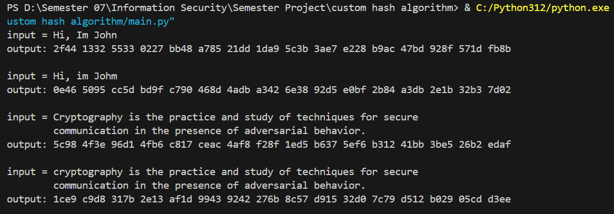
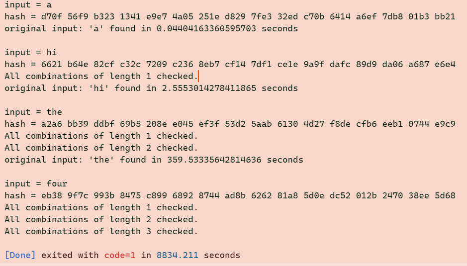

# Custom Hash Algorithm and Brute Force Attack

## Overview
This repository contains the implementation of a **Custom Hashing Algorithm** and a **Brute Force Attack** designed to test the resilience of the hashing mechanism. The custom hashing algorithm processes input strings to produce secure, deterministic hash values, while the brute force script attempts to reverse-engineer the original input using exhaustive search.

---

## Files

### 1. `main.py`
Demonstrates the usage of the **Custom Hashing Algorithm**:
- Converts input strings to ASCII arrays.
- Generates hash values using the `custom_hash` function from the `hash.py` file.
- Outputs the hash value for comparison.

### 2. `hash.py`
Contains the implementation of the **Custom Hashing Algorithm**:
- Converts strings to ASCII and processes them with metadata and convolution operations.
- Produces a 256-bit hash represented in hexadecimal format.
- Steps:
  1. Converts the string to ASCII values.
  2. Adds metadata to remove symmetry and improve security.
  3. Divides the data into blocks and applies custom convolutions.
  4. XORs the results of processed blocks to generate the final hash.

### 3. `bruteforce.py`
Implements the **Brute Force Attack**:
- Generates combinations of characters to attempt reversing the custom hash.
- Tests all possible combinations of strings with lengths up to 3 characters (can be extended).
- Outputs the original string if the hash matches the target.

---

## Usage

### Running the Hashing Algorithm
To see the custom hashing algorithm in action:
1. Run `main.py`:
   ```bash
   python main.py
2. The script will:
   - Process multiple input strings.
   - Output the corresponding hash values.



### Running the Brute Force Attack
To test the brute force attack:
1. Run `bruteforce.py`:
   ```bash
   python bruteforce.py

2. The script will:
   - Attempt to reverse-engineer the input string from its hash.
   - Output the original string if found.


